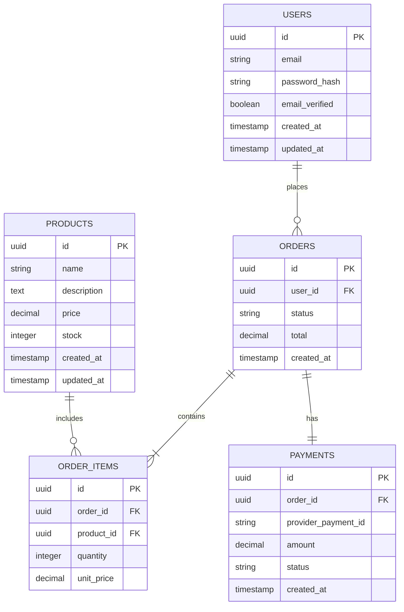

> Sample scaffold file. Keep this example if it helps your team document a schema manually, but do not treat any of the sample entities, constraints, or operational settings here as real project truth until you replace them with repo-specific content.

# Database Schema Example

Use this document when your project has a meaningful database or persistent data model that deserves a durable architecture reference.

If the repo does not have a database, delete this file or leave it clearly marked as an unused sample.

## How to Adapt This Sample

When turning this into a real project document:

1. replace the sample domain and table names with the entities that actually exist in the repo
2. link every major claim to real schema files, migrations, ORM models, or database docs
3. remove sections that do not apply
4. keep operational details only if the repo or deployment setup actually proves them

## Overview

**Database Type**: PostgreSQL 15
**ORM / Query Tool**: Prisma
**Migration Strategy**: Prisma Migrate with reviewed SQL migrations

## Example Domain Model

This sample models a simple commerce workflow:

- `users` manage accounts and place orders
- `products` represent catalog items
- `orders` capture purchases
- `order_items` connect orders to products
- `payments` record payment provider results

## Entity Summary

| Table | Purpose | Key Relationships |
|-------|---------|-------------------|
| `users` | User accounts and authentication state | `users -> orders` |
| `products` | Product catalog and inventory | `products -> order_items` |
| `orders` | Purchase lifecycle and totals | `orders -> users`, `orders -> payments`, `orders -> order_items` |
| `order_items` | Line items for each order | `order_items -> orders`, `order_items -> products` |
| `payments` | External payment transaction results | `payments -> orders` |

## Example Schema Diagram



## Example Table Details

### `users`

**Purpose**: store user identity and authentication state

```sql
CREATE TABLE users (
  id UUID PRIMARY KEY DEFAULT gen_random_uuid(),
  email VARCHAR(255) UNIQUE NOT NULL,
  password_hash VARCHAR(255) NOT NULL,
  email_verified BOOLEAN DEFAULT false,
  created_at TIMESTAMP WITH TIME ZONE DEFAULT NOW(),
  updated_at TIMESTAMP WITH TIME ZONE DEFAULT NOW()
);

CREATE INDEX idx_users_email ON users(email);
```

**Why these fields matter**:

- `email` is unique because login and notification flows assume one account per email
- `password_hash` is stored instead of plaintext credentials
- `email_verified` supports conditional access to downstream actions

### `orders`

**Purpose**: track each purchase lifecycle from creation through payment settlement

```sql
CREATE TABLE orders (
  id UUID PRIMARY KEY DEFAULT gen_random_uuid(),
  user_id UUID NOT NULL REFERENCES users(id) ON DELETE CASCADE,
  status VARCHAR(32) NOT NULL,
  total DECIMAL(10,2) NOT NULL,
  created_at TIMESTAMP WITH TIME ZONE DEFAULT NOW()
);

CREATE INDEX idx_orders_user_created ON orders(user_id, created_at DESC);
```

**Why these fields matter**:

- `status` drives fulfillment and support workflows
- `total` is stored as a decimal to avoid floating-point drift
- `user_id` enables order-history and support queries

### `order_items`

**Purpose**: represent the products and quantities contained in each order

```sql
CREATE TABLE order_items (
  id UUID PRIMARY KEY DEFAULT gen_random_uuid(),
  order_id UUID NOT NULL REFERENCES orders(id) ON DELETE CASCADE,
  product_id UUID NOT NULL REFERENCES products(id) ON DELETE RESTRICT,
  quantity INTEGER NOT NULL CHECK (quantity > 0),
  unit_price DECIMAL(10,2) NOT NULL CHECK (unit_price >= 0)
);
```

**Why this table exists**:

- preserves historical price at time of purchase
- supports multi-item orders
- makes fulfillment and analytics easier than embedding item arrays inside `orders`

## Example Constraints and Business Rules

**Foreign keys**:

- `orders.user_id -> users.id`
- `order_items.order_id -> orders.id`
- `order_items.product_id -> products.id`
- `payments.order_id -> orders.id`

**Checks**:

- `products.price >= 0`
- `products.stock >= 0`
- `order_items.quantity > 0`

**Uniqueness**:

- `users.email`
- `payments.provider_payment_id`

## Example Operational Notes

Use sections like these only when the repo or deployment environment actually proves them.

### Migrations

- migration tool: Prisma Migrate
- migration files: `prisma/migrations/`
- deployment flow: generate, review SQL, validate in staging, then deploy

### Seeds

- seed script: `prisma/seed.ts`
- development fixtures: admin user, sample products, and representative test data

### Performance

- composite index on `orders(user_id, created_at DESC)` for order history
- explicit indexes for login and catalog lookups
- avoid N+1 queries in order summary paths

### Security and Compliance

- dedicated application user instead of superuser credentials
- TLS in transit and encrypted storage at rest
- tokenized payment data instead of raw card data

## Related Documentation

- Architecture decision: [ADR-0001: Use PostgreSQL](adr/0001-example-decision.md)
- Real schema files or migrations: replace with project-specific paths
- Deployment docs or runbooks: replace with project-specific paths
